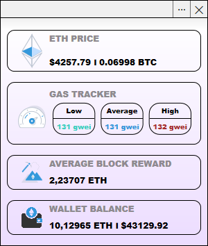

# Ethereum Widget
> Ethereum Widget won't be updated anymore. Instead, check [Modular Widget](https://github.com/Ko1ors/ModularWidget) for an up-to-date version that includes all current features and more
<h3 align="center">Ethereum Widget gives you access to most of the features of Ethereum Blockchain such as price, gas tracking, block reward and wallet balance
</h3>

 

# Settings
* Etherscan API key (optional) - improves the overall speed of API calls. You can create a new API key at https://etherscan.io/myapikey
* Ethereum wallet (optional) - needed to get the balance of the selected wallet
* Update time - time between data update
